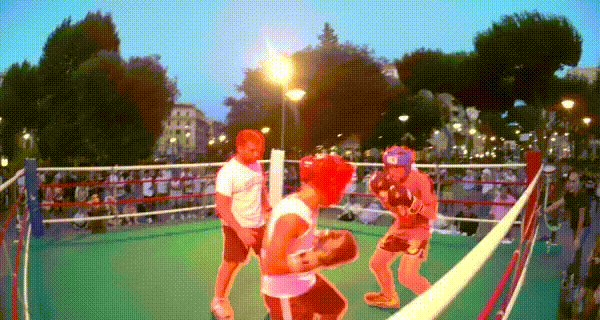
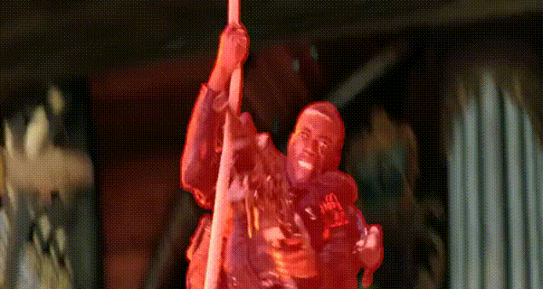
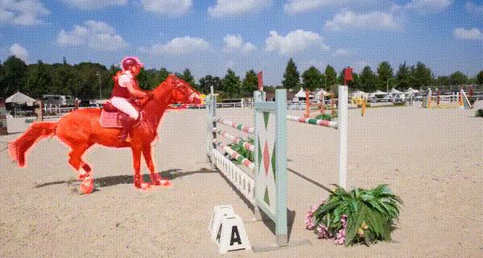
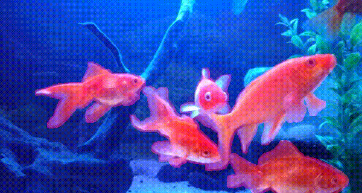
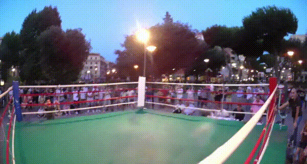
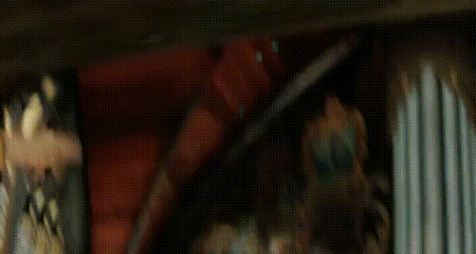
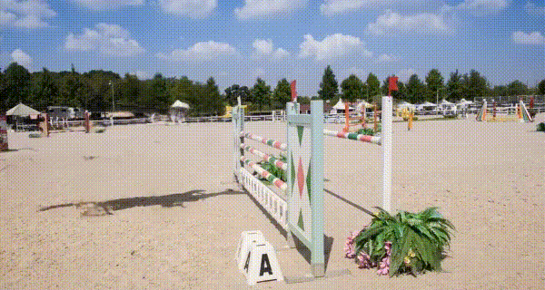
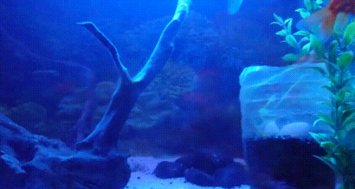
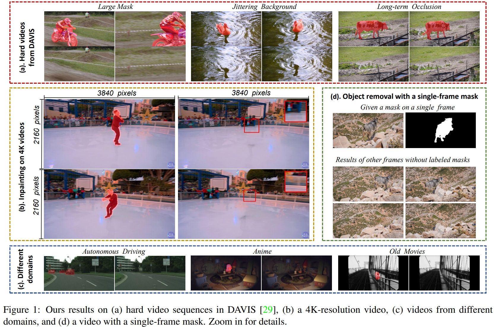

# Implicit Internal Video Inpainting
Implementation for our ICCV2021 paper: Internal Video Inpainting by Implicit Long-range Propagation  

[paper](https://arxiv.org/abs/2108.01912) | [project website](https://tengfei-wang.github.io/Implicit-Internal-Video-Inpainting/) | [4K data](https://github.com/Tengfei-Wang/Annotated-4K-Videos) | [demo video](https://youtu.be/VlDSJtmBqBs)

         

            

Our results on  70 DAVIS videos (including failure cases) can be found  [here](https://hkustconnect-my.sharepoint.com/:f:/g/personal/tfwang_connect_ust_hk/EmtOPEAarqdFj4yDLECg2oABsylzC4lKjuFyyg7o2TTdyQ?e=K8mYHv) for your reference :)   
If you need the PNG version of our uncompressed  results, please contact the authors.
 
## Introduction
Want to remove objects from a video without days of training and thousands of training videos? Try our  simple but effective internal video inpainting method. The inpainting process is zero-shot and implicit, which does not need any pretraining on large datasets or optical-flow estimation. We further extend the proposed method to more challenging tasks:  video object removal with  limited annotated  masks,  and inpainting on ultra high-resolution videos (e.g., 4K videos). 

 


 
## Setup
### Installation
```
git clone https://github.com/Tengfei-Wang/Implicit-Internal-Video-Inpainting.git
cd Implicit-Internal-Video-Inpainting
```

### Environment
This code is based on tensorflow 2.x  (tested on tensorflow 2.0, 2.2, 2.4).

The environment can be simply set up by Anaconda:
```
conda create -n IIVI python=3.7
conda activate IIVI
conda install tensorflow-gpu tensorboard
pip install pyaml 
pip install opencv-python
pip install tensorflow-addons
```

Or, you can also   set up the environment from the provided `environment.yml`:
```
conda env create -f environment.yml
conda activate IIVI
```

## Usage
### Quick Start
We provide an example sequence 'bmx-trees'  in `./inputs/` . To try our  method:
```
python train.py
```
The default iterations is set to 50,000 in `config/train.yml`, and the internal learning takes ~4 hours with a single GPU. 
During the learning process, you can use tensorboard to check the results by:
```
tensorboard --logdir ./exp/logs
```
After the training, the final results can be saved in `./exp/results/` by:
```
python test.py
```
You can also modify  'model_restore' in `config/test.yml` to save results with different checkpoints.
 
### Try Your Own Data
#### Data preprocess
Before training, we advise to dilate the object masks first to exclude some edge pixels. Otherwise, the imperfectly-annotated masks would lead to artifacts in the object removal task.

You can generate and preprocess the masks by this script:
```
python scripts/preprocess_mask.py --annotation_path inputs/annotations/bmx-trees
```

#### Basic training
Modify the `config/train.yml`, which indicates the video path, log path, and training iterations,etc.. The training iterations depends on the video length, and it typically takes 30,000 ~ 80,000 iterations for convergence for 100-frame videos (one a single GPU).
By default, we only use reconstruction loss for training, and it works well for most cases. 
```
python train.py
```

#### Improve the sharpness and consistency
For some hard videos, the former training may not produce a pleasing result. You can fine-tune the trained model with another losses.
To this end, modify the 'model_restore' in `config/test.yml` to the checkpoint path of basic training. Also set ambiguity_loss or stabilization_loss to True. Then fine-tune the 
basic checkpoint for 20,000-40,000 iterations.
```
python train.py
```

#### Inference
Modify the `./config/test.yml`, which indicates the video path, log path, and save path.
```
python test.py
```

#### Distributed training
To accelerate the training process, multi-GPUs can be used.  
To utilize multi-GPUs for training, modify the `./config/train.yml` accordingly. For example, `GPU_ID: '0,1'`, `batch_size: 5`, `lr: 0.0002`.  
```
python train_dist.py
```
Note that we have only tested the distributed training code on tensorflow 2.0. (it may not work for tf 2.4).

### Mask Propagation from A Single Frame
When you only annotate the object mask of one frame (or few frames), our method can propagate it to other frames automatically.

Modify `./config/train_mask.yml`. We typically set the training iterations to 4,000 ~ 20,000, and the learning rate to 1e-5 ~ 1e-4.
```
python train_mask.py
```

After training, modify `./config/test_mask.yml`, and then:
```
python test_mask.py
```

### High-resolution Video Inpainting
Our 4K videos and mask annotations can be downloaded in [4K data](https://github.com/Tengfei-Wang/Annotated-4K-Videos).
 
## Citation
If you find this work useful for your research, please cite:
``` 
@inproceedings{ouyang2021video,
  title={Internal Video Inpainting by Implicit Long-range Propagation},
  author={Ouyang, Hao and Wang, Tengfei and Chen, Qifeng},
  booktitle={International Conference on Computer Vision (ICCV) },
  year={2021}
} 
```

If you are also interested in the image inpainting or internal learning, [this paper](https://tengfei-wang.github.io/EII/index.html) can  be also helpful :)
```
@inproceedings{wang2021image,
  title={Image Inpainting with External-internal Learning and Monochromic Bottleneck},
  author={Wang, Tengfei and Ouyang, Hao and Chen, Qifeng},
  booktitle={Proceedings of the IEEE/CVF Conference on Computer Vision and Pattern Recognition},
  pages={5120--5129},
  year={2021}
}
```

## Contact
Please send emails to [Hao Ouyang](ououkenneth@gmail.com) or [Tengfei Wang](tengfeiwang12@gmail.com)  if there is any question

##  Acknowledgement
We thank the authors of [DeepFill](https://github.com/JiahuiYu/generative_inpainting) for sharing their codes.
